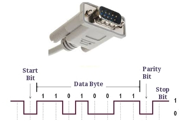

Serial communication manager (SCM)
-----------------------------------



The 'serial communication manager (scm)' is a java library designed and developed to exchange data on serial port. It supports RS-232 control signals handshaking, monitoring and has been ported to Linux, MAC, Solaris and Windows operating system. It is scalable, testable, efficient, reliable and small footprint library.

##Features
- Notification whenever a serial port is removed from system
- Linux, Windows, Mac OS, Solaris OS supported
- Both 32 and 64 bit library support
- Both poll based and listener based data read supported
- Concurrent event driven non-blocking IO
- Leverages OS specific facilities
- Find what all serial style ports are present in system reliably
- Extensive error handling and reliable operations support
- Fully documented both java and native code

##Getting started

The folder prebuilt contains ready-to-use jar file (scm.jar) that can be imported in any project and referenced right away.

###Examples usage
```java
package test2;
import com.embeddedunveiled.serial.SerialComManager;
import com.embeddedunveiled.serial.SerialComManager.BAUDRATE;
import com.embeddedunveiled.serial.SerialComManager.DATABITS;
import com.embeddedunveiled.serial.SerialComManager.FLOWCONTROL;
import com.embeddedunveiled.serial.SerialComManager.PARITY;
import com.embeddedunveiled.serial.SerialComManager.STOPBITS;

public class Test2 {
	public static void main(String[] args) {
	
		long handle = 0;
		
		// get serial communication manager instance
		SerialComManager scm = new SerialComManager();
		
		try {
			// try opening serial port for read and write without exclusive ownership
			handle = scm.openComPort("/dev/ttyUSB1", true, true, false);
			
			// configure data communication related parameters
			scm.configureComPortData(handle, DATABITS.DB_8, STOPBITS.SB_1, PARITY.P_NONE, BAUDRATE.B115200, 0);
			
			// configure line control related parameters
			scm.configureComPortControl(handle, FLOWCONTROL.NONE, 'x', 'x', false, false);
			
			// try to send data out of serial port
			if(scm.writeString(handle, "testing hello", 0) == true) {
				System.out.println("write success \n");
			}
		
			// try to read data from serial port
			String data = scm.readString(handle);
			System.out.println("data read is :" + data);

			// close serial port
			scm.closeComPort(handle);
			
		} catch (Exception e) {
			e.printStackTrace();
		}
	}
}
```
More examples could be found here : https://github.com/RishiGupta12/serial-com-manager/blob/master/example_usage.txt

###Java docs

Detailed javadocs can be found here : https://github.com/RishiGupta12/serial-com-manager/tree/master/javadoc

###Build guide

###Programs to test RS-232

Linux : gtkterm, minicom
Windows :
MAC : 

###Author, License, and Copyright
The 'serial communication manager (scm)' is designed, developed and maintained by Rishi gupta. The Linkdin profile of the author can be found here : http://in.linkedin.com/pub/rishi-gupta/20/9b8/a10

This library is licensed under the LGPL, See LICENSE AND COPYING for full license text.

###Help & Discussion
The wiki page for the project is maintained here https://code.google.com/p/serial-com-manager/w/list
